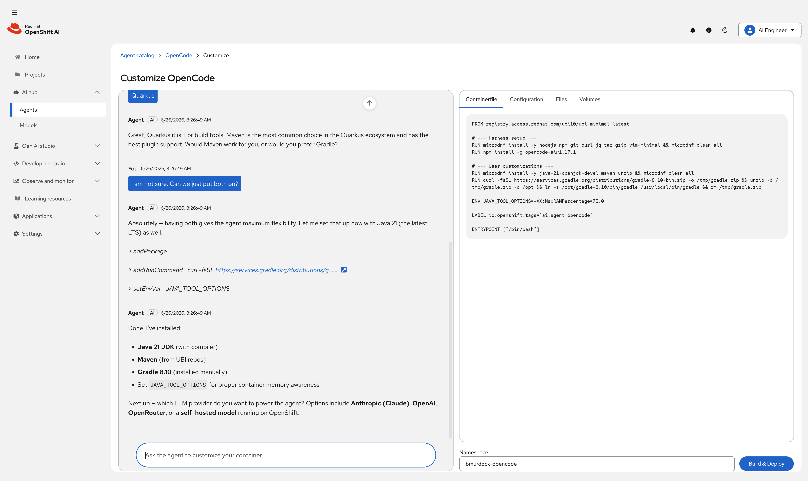

# Agent Catalog Prototype

A working prototype of the Agent Catalog for Red Hat OpenShift AI (RHOAI).
Browse a catalog of AI coding agent harnesses, customize container images
through an AI-guided conversation, and deploy to OpenShift.



## How It Works

1. **Browse** the catalog of agent harnesses
2. **Select** a harness (e.g. OpenCode) to start a customization session
3. **Chat** with the AI agent to configure your container: add packages, set up
   LLM providers, configure MCP servers, manage secrets
4. **Review** the generated Containerfile and configuration in real time
5. **Build and deploy** the customized container image to your OpenShift cluster

## Supported Harnesses

| Harness     | Status  |
|-------------|---------|
| OpenCode    | Working |
| Claude Code | Planned |
| OpenClaw    | Planned |
| Codex       | Planned |

## Prerequisites

- Node.js 22+
- `oc` CLI installed and logged into an OpenShift cluster (for build/deploy)
- [Goose](https://github.com/block/goose) CLI (`brew install block-goose-cli`)

## Setup

```bash
git clone <repo-url>
cd agent-catalog-proto
npm install
```

## Usage

```bash
# Start both frontend and backend (separate terminals)
npm run dev      # Frontend (Vite) on http://localhost:5173
npm run server   # Backend (Express) on http://localhost:3001
```

Open http://localhost:5173 to browse the catalog, select a harness, customize
it through the AI chat, and build/deploy to your OpenShift cluster.

## Tech Stack

- **Frontend:** React 18, PatternFly 6, @patternfly/chatbot
- **Backend:** Node.js, Express (TypeScript)
- **AI agent:** Goose (goosed REST+SSE server) with MCP tool support
- **ContainerSpec tools:** Custom MCP server (TypeScript, in-process)
- **Build/deploy:** OpenShift BuildConfig (Docker strategy, binary source)
- **Bundler:** Vite
- **Tests:** Vitest

## Development

```bash
npm run dev        # Frontend dev server (HMR)
npm run server     # Backend server
npm test           # Run tests
npm run lint       # Lint
npm run typecheck  # Type-check
```

## Project Structure

```
src/
  client/        React 18 + PatternFly 6 frontend
  server/        Node.js + Express backend
  mcp-server/    ContainerSpec MCP server (Goose integration)
  shared/        Shared TypeScript types
tests/           Test files (mirrors src/ structure)
specs/           Specification and reference screenshots
docs/adr/        Architecture Decision Records
```

## Specification

The full project specification is in
[specs/agent-catalog-prototype-spec.md](specs/agent-catalog-prototype-spec.md).
