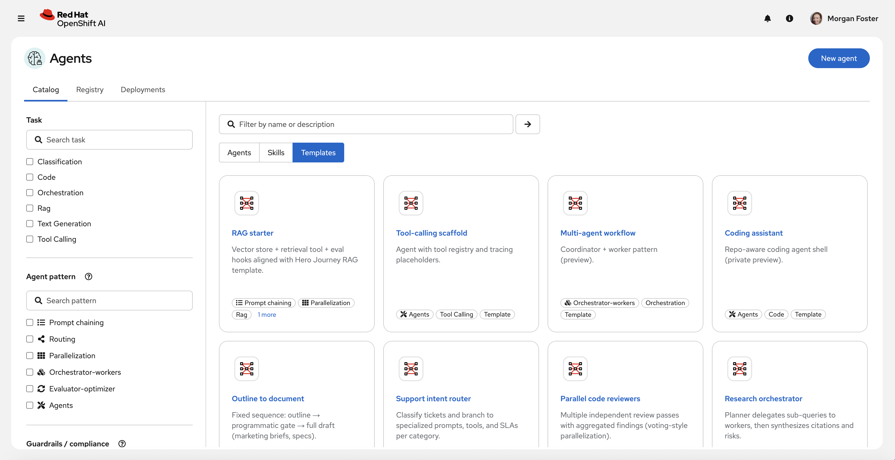
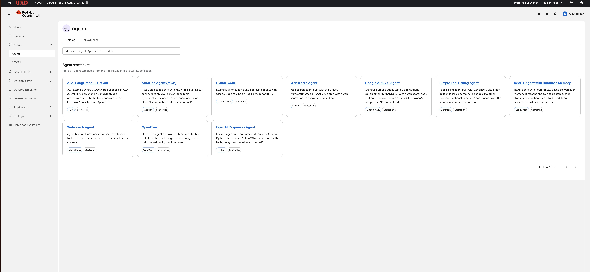
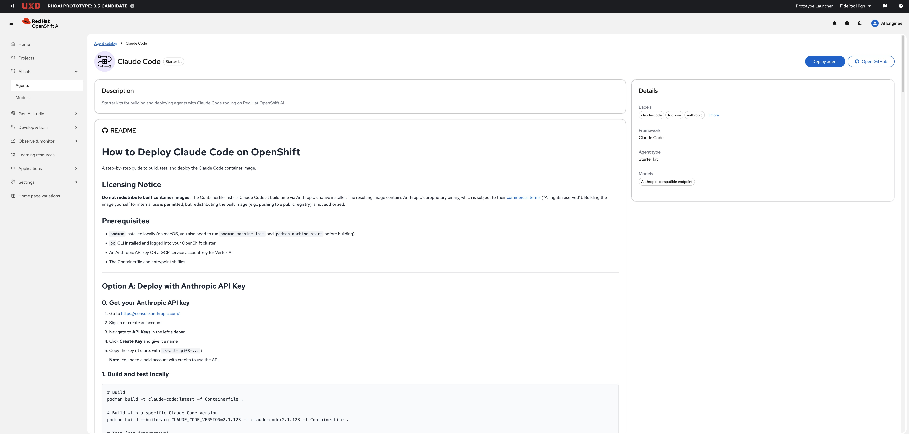
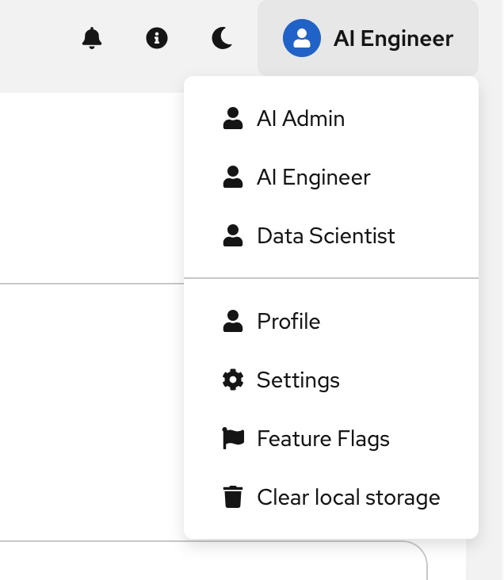

# Agent Catalog Prototype: Specification

**Status:** Draft
**Date:** 2026-06-18
**Author:** Bill Murdock (with assistance from Claude Code)

## 1. Overview

This document specifies a working prototype of the Agent Catalog for Red Hat
OpenShift AI (RHOAI). The prototype lets a user browse a catalog of agentic
harnesses, customize a container image for a selected harness through an
AI-guided conversation, deploy the resulting container to a cluster, and
connect to the running agent.

The prototype targets a single-user, laptop-hosted scenario. It is not
production-grade but should be realistic enough to demonstrate the end-to-end
workflow and inform the design of the productized feature.

### 1.1 Visual Reference

The target look and feel is informed by three reference screenshots in the
`specs/` directory:

**`agent_cat.png`** (early mockup):



An earlier concept showing the Catalog / Registry / Deployments tabs, an
Agents / Skills / Templates subtab row, a left sidebar with Task and Agent
pattern filter checkboxes, and a card grid with icons, names, descriptions,
tags, and a "New agent" button. This screenshot establishes the overall page
structure and PatternFly styling.

**`s1.jpg`** (design prototype, catalog page):



A more recent design prototype (RHOAI 3.5 candidate) showing the catalog
page. Key differences from the earlier mockup:

- Left sidebar navigation: "AI hub" expands to "Agents" and "Models".
- Top-level tabs are "Catalog" and "Deployments" (no "Registry" tab).
- No subtabs (Agents / Skills / Templates row is gone).
- A "Agent starter kits" section heading with a subtitle.
- Cards are simpler: the agent name is a clickable link, followed by a
  short description, and tag chips at the bottom (framework name + "Starter
  kit"). No icon, no license badge, no base image status indicator.
- A search bar at the top: "Search agents (press Enter to add)" with
  chip-based filtering.
- Pagination ("1 - 10 of 10") at the bottom right.

**`s2.jpg`** (design prototype, detail page):



The detail page for Claude Code. Key elements:

- Breadcrumb: "Agent catalog > Claude Code".
- Agent name with an icon and a "Starter kit" badge.
- Two action buttons in the upper right: "Deploy agent" (primary) and
  "Open GitHub" (secondary with GitHub icon).
- A "Description" section with a short summary.
- A "README" section rendering the agent's documentation inline (full
  markdown with headings, code blocks, lists).
- A "Details" sidebar on the right with: Labels (chip list), Framework,
  Agent type, and Models.

**`s3.jpg`** (design prototype, masthead toolbar):



A close-up of the masthead toolbar area (upper right). Key elements:

- Notification bell icon (plain button).
- Info circle icon (plain button).
- Dark/light mode toggle (moon icon). Clicking switches between light and
  dark PatternFly themes.
- User identity dropdown ("AI Engineer") with a blue avatar circle. The
  dropdown contains role options (AI Admin, AI Engineer, Data Scientist),
  a divider, and action items (Profile, Settings, Feature Flags, Clear
  local storage).

**Design guidance:**

Where the design prototype (`s1.jpg`, `s2.jpg`, `s3.jpg`) and the earlier
mockup (`agent_cat.png`) differ, prefer the design prototype as it is more
recent.
The prototype extends the design prototype by adding a customization
experience (chat + spec viewer) that does not appear in any of the reference
screenshots.

The design language is **PatternFly 6**. All UI elements must use PatternFly
components wherever a suitable component exists. This includes:

- Layout: `Page`, `PageSection`, `PageSidebar`, `Masthead`
- Navigation: `Nav`, `NavItem`, `NavExpandable`, `Breadcrumb`
- Content: `Card`, `Gallery`, `Tabs`, `Label`, `SearchInput`
- Data display: `DescriptionList`, `Table`
- Chat: `@patternfly/chatbot` for the AI conversation widget
- Forms: `TextInput`, `FormGroup`, `Button`, `ActionList`
- Feedback: `Alert`, `Spinner`, `EmptyState`

Do not use custom CSS for layout or styling when a PatternFly component
covers the need. PatternFly's spacing, typography, and color tokens should
be used consistently. The prototype need not implement every element visible
in the screenshots (e.g., the full left sidebar navigation), but the elements
it does implement should look right.

### 1.1.1 Goals

- Demonstrate the catalog browse, detail, customize, deploy, connect flow.
- Support at least four harnesses: Claude Code, OpenCode, OpenClaw, and Codex.
- Provide an AI-assisted customization experience using a chat widget alongside
  a live container file viewer.
- Produce a deployable container image as output.
- Run locally on a developer laptop using Vertex AI credentials for the
  AI conversation capability.

### 1.1.2 Non-Goals (for the prototype)

- Multi-user tenancy, RBAC, or SSO integration.
- Production-level security hardening.
- Admin-configurable model provider selection (hardcoded to Vertex AI).
- Deployment to a remote RHOAI cluster (local or local-cluster only).
- The Deployments tab and the Models page shown in the design prototype.
- Guardrails / compliance filtering.


## 2. User Workflow

### 2.1 Browse the Catalog

The user opens the prototype UI in a browser. The left sidebar shows "AI hub"
with "Agents" and "Models" underneath. The main content area shows the
**Catalog** tab selected (a **Deployments** tab is present but out of scope
for the prototype).

A search bar at the top allows filtering by agent name (chip-based,
"press Enter to add" pattern from the design prototype).

Below the search bar, a section heading reads "Agent starter kits" with a
subtitle. Each agent harness appears as a card showing:

| Field | Example (Claude Code) |
|-------|-----------------------|
| Name | Claude Code (clickable link) |
| Short description | Starter kits for building and deploying agents with Claude Code tooling on Red Hat OpenShift AI. |
| Tags | `Claude Code`, `Starter kit` |

Cards follow the design prototype style: no icon on the card itself, the
agent name is a link to the detail page, and tag chips appear at the bottom.
Pagination appears at the bottom right if there are many entries.

### 2.2 View Agent Details

Clicking the agent name on a card opens a detail view. Following the design
prototype layout:

- **Breadcrumb:** "Agent catalog > [Agent Name]".
- **Header:** Agent name with an icon and a "Starter kit" badge.
- **Action buttons** (upper right):
  - **"Customize and Deploy"** (primary). This is the prototype's extension
    of the "Deploy agent" button shown in the design prototype; it opens the
    customization experience (Section 3) instead of deploying directly.
  - **"Open GitHub"** (secondary, links to the upstream project repo).
- **Description section:** A short summary of the agent.
- **README section:** The agent's documentation rendered inline as markdown
  (headings, code blocks, lists, etc.). For the prototype, this can be a
  curated subset of the upstream README covering deployment guidance and
  prerequisites.
- **Details sidebar** (right side):
  - **Labels:** Tag chips (e.g., `claude-code`, `tool use`, `anthropic`).
  - **Framework:** The agent framework name (e.g., "Claude Code").
  - **Agent type:** "Starter kit" for the prototype.
  - **Models:** Supported model endpoints (e.g., "Anthropic-compatible
    endpoint").

### 2.3 Customize the Container (AI-Guided)

Clicking "Customize and Deploy" opens the customization experience. This is the
core of the prototype and is described in detail in Sections 3 and 4.

### 2.4 Deploy

After customization is complete, the user clicks a "Build & Deploy" button. The
system:

1. Generates the Containerfile from the current ContainerSpec.
2. Creates a BuildConfig and ImageStream on the OpenShift cluster.
3. Starts the build via `oc start-build --from-dir=.`, sending the
   Containerfile and source context to the cluster. The build runs on-cluster
   and pushes the resulting image to the internal OpenShift registry.
4. Applies Kubernetes manifests (Deployment, PVC, ConfigMap, Secret, Service)
   referencing the built image.
5. Streams build and deployment logs in the UI.

See Section 5.4 for details on the build strategy.

### 2.5 Connect to the Agent

Once deployed, the UI shows connection information:

- A copyable `kubectl exec` or `oc exec` command to start an interactive
  session with the agent.
- For agents with a web UI (e.g., OpenClaw), a URL or port-forward command.
- Status indicator showing the pod is running and healthy.


## 3. Customization Experience

The customization view is a split-pane layout:

```
+---------------------------------------------+
|  Chat (PatternFly AI)  |  Container Viewer   |
|                        |                     |
|  User: I need Node 22, | FROM ubi10-minimal  |
|  Python 3.12, and the  | RUN microdnf ...    |
|  GitHub CLI.           | ...                 |
|                        |                     |
|  AI: I've added those. | [live updates]      |
|  I also added npm and  |                     |
|  pip. Do you need any  |                     |
|  specific npm packages | +--tabs-----------+ |
|  or pip packages       | | Containerfile    | |
|  pre-installed?        | | Env Vars         | |
|                        | | Files            | |
|  User: Yes, add        | | Volumes          | |
|  eslint and pytest.    | +------------------+ |
|                        |                     |
+---------------------------------------------+
|        [ Build & Deploy ]                     |
+---------------------------------------------+
```

### 3.1 Chat Pane (Left)

- Uses the **PatternFly AI chat widget** (`@patternfly/chatbot`).
- Connected to an AI harness backend (see Section 4).
- The AI guides the user through a structured conversation covering:
  1. **Tooling and SDKs:** What languages, runtimes, build tools, and linters
     does the user need?
  2. **Agent-specific configuration:** Model provider, model selection.
  3. **Files to inject:** CLAUDE.md, skills, MCP server configs, repo clones.
  4. **Environment variables and secrets:** The AI identifies what secrets are
     needed (e.g., API keys, Git PATs) but never collects the actual values.
     Secret values are entered via the Env Vars tab in the right pane, not
     through the chat. See Section 3.3 for details.
  5. **Persistent storage:** Workspace size, what to persist across restarts.
  6. **Review:** Summary of all choices before build.

The AI modifies the container specification in real time as the conversation
proceeds. Each change is reflected immediately in the right pane.

### 3.2 Container Viewer Pane (Right)

A tabbed viewer showing the current state of the container specification:

**Containerfile tab:**
- Syntax-highlighted view of the generated Containerfile.
- Read-only in the prototype (edits happen through chat). A stretch goal would
  allow direct editing with the AI acknowledging the manual changes.

**Env Vars tab:**
- Table of environment variables that will be set on the container.
- Columns: Name, Value (masked for secrets), Source (literal / secret ref).
- The AI populates names and descriptions as the conversation proceeds.
- **Secret values are entered here, not in the chat.** When the AI adds a
  secret (via the `addSecret` MCP tool), a row appears with a password input
  field. The user enters the value directly in this form. The value is sent
  from the browser to the backend only, never to Goose or the LLM.
- Non-secret env vars (e.g., `CLAUDE_MODEL=claude-sonnet-4-6`) can be set
  by the AI directly and appear as plain text.

**Files tab:**
- List of files that will be injected into the container or mounted via
  ConfigMap.
- Shows source path (local file or URL) and destination path in the container.
- Includes skills, MCP configs, settings files, CLAUDE.md, etc.

**Volumes tab:**
- PVC definitions: mount path, size, access mode.
- Shows what data persists across restarts.


### 3.3 Secrets Handling

Secrets (API keys, Git PATs, MCP auth tokens, etc.) require special handling
to avoid leaking sensitive values through the AI conversation.

**Core principle: Secret values never enter the chat.**

The AI conversation identifies *what* secrets are needed (names and
descriptions), but the actual values are collected through a separate UI path
that bypasses Goose and the LLM entirely.

**Flow:**

1. During the customization conversation, the AI determines that a secret is
   needed (e.g., "You'll need an Anthropic API key for this agent").
2. The AI calls the `addSecret` MCP tool with a name and description, but no
   value.
3. The Env Vars tab in the right pane shows a new row with a password input
   field for that secret.
4. The user enters the secret value in the form (not in the chat).
5. The AI is instructed (via the recipe system prompt) to tell the user:
   "Enter your API key in the Env Vars tab on the right. Do not paste it in
   this chat."
6. At deploy time, the backend creates a K8s Secret on the cluster:
   `oc create secret generic agent-secrets-<session-id> --from-literal=<name>=<value>`
7. The Deployment references the secret via `secretKeyRef`.

**Security boundaries:**

- Secret values are **never sent to Goose or the LLM**. They travel only
  from the browser to the prototype backend (localhost in the prototype).
- The backend holds secret values **in memory only, never on disk**. Values
  are passed directly to the `oc create secret` command and then discarded
  from memory.
- The only persistent storage of the secret value is the **Kubernetes Secret
  object** on the cluster.
- The Containerfile and ContainerSpec never contain secret values. The
  Deployment manifest references secrets by name, not by value.
- The chat transcript and Goose session history contain only secret names
  and descriptions, never values.

**Kubernetes Secrets limitation (prototype vs. product):**

Kubernetes Secrets are base64-encoded, not encrypted at rest by default. They
are readable by anyone with RBAC access to the namespace. For the prototype,
this is acceptable. For the product, secrets should be managed via a proper
secrets manager such as:

- HashiCorp Vault (with the Vault CSI provider or external-secrets operator).
- OpenShift's built-in etcd encryption for Secrets at rest.
- An external secrets operator that syncs from a cloud provider's secret
  store (AWS Secrets Manager, GCP Secret Manager, Azure Key Vault).

The product should also consider whether secret values should be entered in
the RHOAI UI at all, or whether users should pre-provision secrets on the
cluster and the catalog should only reference them by name.

**MCP tool for secrets:**

```
addSecret:
  name: string         -- env var name (e.g., "ANTHROPIC_API_KEY")
  description: string  -- human-readable description shown in the Env Vars tab
```

This tool adds a secret placeholder to the ContainerSpec. It has no `value`
parameter. The value is collected separately via the Env Vars tab form.


### 3.4 Skills and Extensions

"Skills" is an umbrella term for the prompt files, tool configurations, and
extensions that make an agent useful for a specific task. Each harness has
its own skill system, but the customization conversation handles them all
through the same underlying mechanisms: the `addFile`, `addRunCommand`, and
`addPackage` MCP tools.

#### 3.4.1 Why MCP Tools

The ContainerSpec mutation tools (`addPackage`, `addFile`, `setEnvVar`, etc.)
are implemented as an MCP server rather than as custom code inside the AI
agent. This follows from the choice of Goose as the AI backend: Goose's
native extension mechanism is MCP. When you want Goose to interact with
an external system, you give it an MCP server that exposes operations as
tools. Goose discovers the tools via the MCP protocol, sees their parameter
schemas, and calls them during the conversation.

This means:

- **No Goose modifications.** The ContainerSpec MCP server is a standalone
  TypeScript process that Goose connects to as an extension (configured in
  the recipe YAML). We never fork or patch Goose.
- **Portability.** MCP is a standard, not Goose-specific. If the backend
  were ever swapped to another MCP-capable agent, the ContainerSpec tools
  would work without changes.
- **Clean separation.** The MCP server runs in-process with the Node.js
  backend, sharing the ContainerSpec state directly and pushing updates to
  the frontend via WebSocket. Goose only sees the tool interface.

#### 3.4.2 What Counts as a Skill

Depending on the harness, a "skill" may be:

- **A prompt file.** Claude Code uses `CLAUDE.md` files and skill
  directories under `/etc/claude-skills/`. OpenCode uses prompt files in
  its config directory. These are text files that shape agent behavior.
- **An MCP server configuration.** Many agents can connect to MCP servers
  at runtime for capabilities like database access, API integration, or
  domain-specific tools. This requires installing the MCP server binary or
  package in the container and adding a config entry.
- **A plugin or extension.** OpenClaw has a plugin system (npm packages
  installed at startup). Other harnesses may have similar concepts.
- **A curated skill from a registry.** The `opendatahub-io/skills-registry`
  contains pre-built skills for common tasks. The skills registry can be
  cloned into the container during customization.

#### 3.4.3 How Skills Are Added During Customization

The AI conversation guides the user through skill selection as part of the
customization workflow. The recipe system prompt includes knowledge of each
harness's skill system. The flow varies by skill type:

**Prompt files (CLAUDE.md, custom instructions):**

1. The AI asks the user what kind of work the agent will do.
2. Based on the answer, the AI may suggest a pre-written CLAUDE.md or
   prompt file, or help the user draft one.
3. The AI calls `addFile` with `sourceType: "inline"` and the prompt
   content, targeting the harness-specific location (e.g.,
   `/workspace/CLAUDE.md` for Claude Code,
   `/home/agent-ci/.config/opencode/` for OpenCode).
4. The file appears in the Files tab on the right pane.

**MCP server configuration:**

1. The AI asks what tools the agent needs at runtime (e.g., "Do you need
   database access, Jira integration, or other API connections?").
2. For each MCP server, the AI:
   - Calls `addPackage` or `addRunCommand` to install the server binary or
     npm package in the container.
   - Calls `addFile` to write the MCP config entry into the harness-specific
     config file (e.g., Claude Code's `mcp_config.json`, OpenCode's
     `opencode.json`).
   - Calls `addSecret` if the MCP server requires credentials (e.g., an API
     token), directing the user to enter the value in the Env Vars tab.

**Registry skills:**

1. The AI presents known skills from the `opendatahub-io/skills-registry`
   or other curated sources relevant to the harness.
2. The user selects which skills to include.
3. The AI calls `addRunCommand` to clone or copy the skill files into the
   appropriate directory, or calls `addFile` for individual skill files.

**OpenClaw plugins:**

1. The AI asks which plugins to enable (vault, openshell, etc.).
2. For each plugin, the AI calls `addRunCommand` to add the npm install
   command to the entrypoint or init script.

#### 3.4.4 Harness-Specific Skill Locations

| Harness | Skill mechanism | Container path |
|---------|----------------|----------------|
| Claude Code | CLAUDE.md + skill directories | `/workspace/CLAUDE.md`, `/etc/claude-skills/*/` |
| Claude Code | MCP server config | `/home/claude-agent/.claude/mcp_config.json` |
| OpenCode | Config + prompt files | `/home/agent-ci/.config/opencode/` |
| OpenCode | Skills registry | `/tmp/agentic-ci/skills/` (cloned during customization) |
| OpenClaw | Plugins (npm packages) | Installed via entrypoint, config in `/home/node/.openclaw/` |
| Codex | TBD | TBD |

The AI knows these paths from the recipe system prompt and uses the correct
locations automatically. The user does not need to know the container
filesystem layout.


## 4. AI Conversation Backend

### 4.1 Architecture

The AI conversation that powers customization uses **Goose**
(https://github.com/aaif-goose/goose), an open-source AI agent by Block, now
under the Linux Foundation's Agentic AI Foundation (AAIF). Goose is Apache 2.0
licensed, built in Rust, and provides a REST+SSE server (`goosed`) purpose-built
for embedding an agent behind a custom UI.

```
PatternFly Chat Widget
        |
        v (SSE streaming)
  Prototype Backend (Node.js / Express)
        |
        v (REST+SSE, proxied to goosed)
  Goose Server (goosed)
    - configured with "container-customizer" recipe
    - connected to ContainerSpec MCP server
    - LLM provider: Vertex AI (prototype) / admin-configured (product)
        |                          |
        v                          v
  Vertex AI (Claude model)    ContainerSpec MCP Server (Node.js)
                                - addPackage, setEnvVar, addFile, etc.
                                - mutates ContainerSpec state
                                - pushes updates to frontend via WebSocket
```

### 4.2 Why Goose

We evaluated several options for the AI conversation backend:

- **Lightweight SDK approach (Vercel AI SDK, LangChain.js):** These provide
  LLM tool-calling but lack the full agent capabilities needed for the product
  vision: compaction (context window management), progressive skill disclosure,
  built-in file system and bash tools, and autonomous repo exploration. Building
  these on top of an SDK would replicate what established harnesses already do,
  poorly.

- **Pi** (https://github.com/earendil-works/pi, 62.8k stars, MIT,
  TypeScript-native): Has RPC mode and an embeddable SDK (`AgentSession`). Has
  skills and extensions. However, its core is intentionally minimal (4 tools:
  Read, Write, Edit, Bash). Capabilities like web search, repo analysis, and
  project detection would need to be built as custom extensions. Good for
  maximum control, but more upfront work.

- **OpenHands** (https://github.com/OpenHands/OpenHands, 75k+ stars, MIT):
  Most capable agent. Has REST API, headless mode, and Docker sandboxing. But
  it is Python-based (mismatch with the TypeScript frontend stack), requires
  Docker for its sandbox, and is designed as a platform rather than an
  embeddable component.

- **Goose** (https://github.com/aaif-goose/goose, 49.5k stars, Apache 2.0):
  Best fit. See below.

**Goose advantages for this use case:**

- **REST+SSE server (`goosed`).** Goose ships a dedicated server binary with
  ~103 REST endpoints covering agent lifecycle, sessions, and streaming. The
  Goose desktop app already uses this, so the interface is proven. The
  PatternFly chat widget connects to it via SSE for streaming responses.

- **MCP (Model Context Protocol) support.** Goose connects to 3000+ MCP
  servers. The ContainerSpec mutation tools (`addPackage`, `setEnvVar`, etc.)
  are implemented as a custom MCP server in TypeScript. This is a clean,
  standards-based integration: the agent discovers and calls tools via MCP,
  and the MCP server mutates the ContainerSpec and pushes updates to the
  frontend. No custom agent modifications needed.

- **Built-in agent capabilities.** File system access, bash execution, web
  browsing, and repo cloning come out of the box. The agent can clone a user's
  repo, read `package.json` / `go.mod` / `Cargo.toml`, and infer what tools
  to install, without custom tool development.

- **Compaction.** Context window management is handled by the Goose agent core.
  Long customization conversations that involve reading many files from a
  cloned repo will not blow the context window.

- **Recipes.** Goose's recipe system configures agent behavior: system prompt,
  available tools, workflow steps. A "container-customizer" recipe defines how
  the agent guides the user through the customization conversation.

- **Custom distributions.** Goose supports shipping pre-configured
  distributions with specific recipes, extensions, and MCP servers baked in.
  The Agent Catalog could ship a "customizer" distribution of Goose.

- **Multi-provider LLM support.** Goose works with 15+ providers (Anthropic,
  OpenAI, Google, Ollama, etc.). For the prototype we configure it with
  Vertex AI. In the product, the admin configures the provider.

- **Mature and backed.** Apache 2.0, Linux Foundation stewardship, active
  development, Rust for performance. Moving toward a single `goose serve`
  binary with ACP (Agent Client Protocol) support.

### 4.3 Goose Integration Design

#### 4.3.1 Goose Server Lifecycle

The prototype backend manages the Goose server process:

1. On startup, the backend launches `goosed` as a child process (or connects
   to an already-running instance).
2. `goosed` is configured with the Vertex AI provider and the
   container-customizer recipe.
3. The ContainerSpec MCP server starts as a separate process (or in-process
   in the Node.js backend) and registers with Goose.

#### 4.3.2 ContainerSpec MCP Server

A lightweight MCP server (TypeScript, running in the Node.js backend process)
exposes tools for mutating the container specification. Goose discovers these
tools via MCP and calls them during the conversation.

**MCP Tool definitions:**

| Tool | Parameters | Effect |
|------|-----------|--------|
| `setBaseImage` | `image: string` | Set the FROM line |
| `addPackage` | `manager: "microdnf"\|"npm"\|"pip"\|"go"\|"cargo"`, `packages: string[]` | Append a RUN line installing packages |
| `addRunCommand` | `command: string` | Append an arbitrary RUN line |
| `setEnvVar` | `name: string`, `value: string` | Add or update a non-secret env var |
| `addSecret` | `name: string`, `description: string` | Add a secret placeholder (value collected via UI, not chat) |
| `addFile` | `sourcePath: string`, `destPath: string`, `sourceType: "local"\|"url"\|"inline"`, `content?: string` | Register a file for injection |
| `addVolume` | `mountPath: string`, `size: string`, `accessMode: string` | Add a PVC definition |
| `setEntrypoint` | `command: string[]` | Set the container entrypoint |
| `addLabel` | `key: string`, `value: string` | Add a label to the image |
| `getSpec` | (none) | Return the current full spec (for the AI to review) |

Each tool call mutates a `ContainerSpec` object on the server and triggers a
real-time update to the right pane via WebSocket.

#### 4.3.3 Container-Customizer Recipe

The Goose recipe for container customization is a YAML file. One recipe is
created per harness in the catalog. Here is an example for OpenCode:

```yaml
version: 1.0.0
title: OpenCode Container Customizer
description: Customize an OpenCode agent container image for deployment

settings:
  goose_provider: "google"
  goose_model: "claude-sonnet-4-6"

parameters:
  - key: harness_id
    input_type: string
    requirement: required
    description: "The harness being customized"
  - key: base_image
    input_type: string
    requirement: required
    description: "The base container image URL"

instructions: |
  You are a container customization assistant for Red Hat OpenShift AI.
  You help users configure container images for AI coding agents.

  The user has selected the {{ harness_id }} harness. The container
  builds from UBI 10 minimal. The harness setup (agent install, system
  packages) is already in the Containerfile under "Harness setup."

  Guide the user through:
  1. Understanding their project (offer to clone their repo and analyze
     project files like package.json, go.mod, Cargo.toml, etc.)
  2. Selecting additional language runtimes, SDKs, and build tools
  3. Configuring linting and formatting tools
  4. Setting up non-secret environment variables
  5. Identifying required secrets (use the addSecret tool; NEVER collect
     secret values in this chat, tell the user to use the Env Vars tab)
  6. Configuring MCP servers for the deployed agent
  7. Setting up persistent storage volumes
  8. Reviewing the complete configuration before build

  Use the ContainerSpec tools to modify the specification as you go.
  Each tool call updates the live preview the user sees on the right.

extensions:
  - type: builtin
    name: developer
    timeout: 300
  - type: stdio
    name: containerspec
    cmd: node
    args: ["./mcp-servers/containerspec-server.js"]
    description: "Tools for modifying the container specification"
    timeout: 300

prompt: |
  I'll help you customize an OpenCode container image for deployment
  on OpenShift.

  What project will you be working on with this agent? If you share a
  Git repo URL, I can clone it and analyze the codebase to suggest the
  right tools and configuration.
```

**Key recipe fields:**

- `instructions`: The system prompt. Uses `{{ parameter }}` templating to
  inject harness-specific context. Contains the secret handling rules
  (never collect values in chat).
- `prompt`: The initial message shown to the user when the customization
  session starts.
- `extensions`: MCP servers available to the agent. Includes the built-in
  `developer` extension (file system, bash) and our custom `containerspec`
  MCP server (stdio transport, runs as a Node.js process).
- `parameters`: Typed inputs passed to the recipe at session start. The
  prototype backend sets these when the user clicks "Customize and Deploy"
  on a harness detail page.
- `settings`: Pins the LLM provider and model. For the prototype, this is
  Google/Vertex AI with Claude Sonnet.

Each harness gets its own recipe file with tailored instructions (e.g.,
the Claude Code recipe would include steps for configuring the Claude
installer, SKIP_PERMISSIONS, and the entrypoint script).

#### 4.3.4 Chat Widget Integration

The Node.js backend proxies between the PatternFly chat widget and `goosed`:

- **User message in:** The frontend sends a chat message to the backend via
  POST. The backend forwards it to `goosed`'s session API.
- **Agent response out:** `goosed` streams the response via SSE. The backend
  relays the SSE stream to the frontend, where the PatternFly chatbot renders
  it incrementally.
- **Spec updates:** When Goose calls a ContainerSpec MCP tool, the MCP server
  (running in-process) mutates the spec and pushes the update to the frontend
  via a separate WebSocket channel. The right pane re-renders.

This separation (SSE for chat, WebSocket for spec updates) keeps the two
streams independent. The chat can be mid-sentence while a spec update arrives
from a tool call.

### 4.4 Model and Credentials (Prototype)

- Model: Claude Sonnet (via Vertex AI), configured in Goose's provider
  settings.
- Credentials: `GOOGLE_APPLICATION_CREDENTIALS` or Application Default
  Credentials (ADC) must be set in the environment where the prototype runs.
  Goose picks these up natively when configured with the Google/Vertex
  provider.
- In the product, the admin would configure the model provider and credentials
  via the RHOAI admin UI. Goose supports 15+ providers, so the admin could
  choose Anthropic, OpenAI, a self-hosted vLLM endpoint, or any other
  supported provider.

### 4.5 Harness-Specific Base Configurations

Each harness in the catalog has a base configuration that the AI starts from.
This is a TypeScript object checked into `src/client/data/harnesses.ts`.

All harnesses build from UBI 10 minimal
(`registry.access.redhat.com/ubi10/ubi-minimal:latest`). The agent and its
dependencies are installed via `setupCommands` in the generated Containerfile,
under a "Harness setup" comment section. User customizations added by the AI
appear under a separate "User customizations" section.

**OpenCode base config (first harness to implement):**
- Setup: installs Node.js, npm, git, curl, jq, tar, gzip, vim-minimal, then
  `npm install -g opencode-ai@1.17.1`.
- Customization covers: language runtimes, build tools, linting tools,
  LLM provider credentials, MCP server configuration, persistent storage.
- Entrypoint: `/bin/bash`.
- PVC at `/workspace` (1Gi default).

**Claude Code base config:**
- Setup: installs git, curl, jq, tar, python3.12, pip, Node.js, npm, then
  Claude Code via native installer (`curl -fsSL https://claude.ai/install.sh | sh`).
- Requires: Anthropic API key or Vertex AI credentials as a secret.
- PVC at `/workspace` (1Gi default).
- Note: Anthropic licensing restricts redistribution of built images containing
  Claude Code. Building for internal use is permitted.

**OpenClaw base config:**
- Setup: installs Node.js, npm, git, curl, then `npm install -g openclaw`.
- Plugin system for extensions (vault, openshell, etc.).
- Requires: API credentials for the LLM provider.
- PVC for `/home/node/.openclaw` (SQLite state, requires block storage).

**Codex base config:**
- Setup: installs git, curl, Node.js, npm, then `npm install -g @openai/codex`.
- Requires: OpenAI API key.
- PVC at `/workspace` (1Gi default).


## 5. Technical Architecture

### 5.1 Component Diagram

```
Browser
  |
  +-- React App (PatternFly)
  |     +-- CatalogPage (card grid)
  |     +-- DetailPage (harness info + deploy button)
  |     +-- CustomizePage
  |     |     +-- ChatPane (PatternFly AI chatbot)  <-- SSE stream
  |     |     +-- SpecViewerPane (tabbed)           <-- WebSocket updates
  |     +-- DeployPage (build logs, status, connect info)
  |
  +-- SSE (chat streaming) + WebSocket (spec updates)
  |
Backend (Node.js / Express)
  |
  +-- /api/catalog          GET    List harnesses
  +-- /api/catalog/:id      GET    Harness detail
  +-- /api/session          POST   Start customization session
  +-- /api/session/:id/chat POST   Send chat message (proxied to goosed)
  +-- /api/session/:id/spec GET    Current container spec
  +-- /api/build            POST   Build container image
  +-- /api/deploy           POST   Deploy to cluster
  +-- /api/deployments      GET    List deployments
  +-- /api/deployments/:id  GET    Deployment status + connect info
  |
  +-- Goose Integration Layer
  |     +-- Manages goosed child process lifecycle
  |     +-- Proxies chat messages to/from goosed REST+SSE API
  |     +-- Loads harness-specific recipe on session start
  |
  +-- ContainerSpec MCP Server (in-process)
  |     +-- MCP tools: addPackage, setEnvVar, addFile, addVolume, etc.
  |     +-- ContainerSpec state object
  |     +-- Pushes spec updates to frontend via WebSocket
  |
  +-- Build Layer
  |     +-- Containerfile generator (renders ContainerSpec to Containerfile)
  |     +-- BuildConfigBackend (prototype: oc start-build --from-dir)
  |     +-- Image lands in OpenShift internal registry via ImageStream
  |
  +-- Deploy Layer
        +-- Manifest generator (Deployment, PVC, ConfigMap, Secret, Service)
        +-- kubectl / oc apply
        +-- Status polling

Goose Server (goosed, separate process)
  |
  +-- Configured with Vertex AI provider (prototype)
  +-- Container-customizer recipe loaded per session
  +-- Connected to ContainerSpec MCP server
  +-- Built-in tools: file system, bash, web browsing
  +-- Agent loop with compaction, tool use, streaming
  |
  +-- Vertex AI  -->  Claude model
```

### 5.2 Technology Stack

| Layer | Technology | Rationale |
|-------|-----------|-----------|
| Frontend | React 18 + PatternFly 6 | RHOAI standard UI framework |
| Chat widget | `@patternfly/chatbot` | Official PF component for AI chat |
| Backend | Node.js + Express (TypeScript) | Matches PF ecosystem, hosts MCP server in-process |
| AI agent | Goose (`goosed` server) | Open-source (Apache 2.0), REST+SSE API, MCP support, built-in tools, compaction, recipes. See Section 4. |
| ContainerSpec tools | Custom MCP server (TypeScript) | Runs in-process in the backend. Goose calls these via MCP to mutate the container spec. |
| Container build | OpenShift BuildConfig (Docker strategy, binary source) | On-cluster builds via `oc start-build --from-dir`. Already proven on the dev cluster. Product would migrate to Builds for Red Hat OpenShift (Shipwright). See Section 5.4. |
| Deployment target | OpenShift cluster (via kubeconfig / `oc`) | Prototype deploys to a real OpenShift cluster. |
| K8s client | `@kubernetes/client-node` | Programmatic manifest apply and status polling |

### 5.3 Data Model

**ContainerSpec** (server-side state per session):

```typescript
interface ContainerSpec {
  harnessId: string;
  baseImage: string;
  buildArgs: Record<string, string>;
  setupCommands: string[];         // harness-defined install commands (not AI-editable)
  runCommands: string[];           // user customization RUN lines (added by AI tools)
  envVars: EnvVarSpec[];
  secrets: SecretSpec[];             // values collected separately via UI
  files: FileSpec[];
  volumes: VolumeSpec[];
  entrypoint: string[];
  labels: Record<string, string>;
  exposedPorts: number[];
}

interface EnvVarSpec {
  name: string;
  value: string;
}

interface SecretSpec {
  name: string;                    // env var name
  description: string;             // shown in the UI
  // value is NOT stored in ContainerSpec. It is collected via the
  // Env Vars tab form and held in memory only until K8s Secret creation.
}

interface FileSpec {
  sourcePath: string;              // local path, URL, or "inline"
  destPath: string;                // path inside container
  sourceType: "local" | "url" | "inline";
  content?: string;                // for inline files
  mountType: "copy" | "configmap"; // baked into image vs. mounted at runtime
}

interface VolumeSpec {
  name: string;
  mountPath: string;
  size: string;                    // e.g., "1Gi"
  accessMode: string;              // e.g., "ReadWriteOnce"
  storageClass?: string;
}
```

**HarnessDefinition** (catalog entry):

```typescript
interface HarnessDefinition {
  id: string;
  name: string;
  description: string;
  longDescription: string;
  icon: string;                    // path to icon asset
  tags: string[];
  license: "open-source" | "proprietary";
  hasBaseImage: boolean;
  baseConfig: ContainerSpec;       // starting point for customization
  systemPrompt: string;            // AI system prompt for this harness
  documentationUrl: string;
  backends: BackendOption[];
}

interface BackendOption {
  id: string;
  name: string;                    // e.g., "Anthropic API", "Vertex AI"
  description: string;
  requiredEnvVars: string[];
}
```

### 5.4 Container Build Strategy

#### 5.4.1 Background: How Container Images Get Built

For context, building a container image means taking a Containerfile (a recipe
listing a base image, packages to install, files to copy, etc.) and producing
a runnable image from it. Traditionally this is done locally with tools like
Podman or Docker. But on an OpenShift cluster, there are ways to do this
on the cluster itself, so no local build tooling is needed.

#### 5.4.2 Prototype: OpenShift BuildConfig (On-Cluster Builds)

The prototype builds images **on the OpenShift cluster** using the built-in
BuildConfig system. This eliminates the need for Podman or any build tooling
on the developer's laptop. The user only needs `oc` CLI access to the cluster.

This pattern is already proven on the dev cluster, where BuildConfig with
Docker strategy and binary source is used for claude-code, openclaw, and other
agent deployments.

**How it works:**

1. The prototype backend generates a Containerfile and gathers the source
   context (entrypoint scripts, config files, etc.) into a temporary directory.
2. It creates a BuildConfig and ImageStream on the cluster via the K8s API:
   ```yaml
   apiVersion: build.openshift.io/v1
   kind: BuildConfig
   metadata:
     name: agent-<harness>-<session-id>
   spec:
     output:
       to:
         kind: ImageStreamTag
         name: agent-<harness>-<session-id>:latest
     source:
       type: Binary
     strategy:
       type: Docker
       dockerStrategy: {}
   ```
3. It starts the build by invoking `oc start-build <name> --from-dir=<context>
   --follow`, which uploads the Containerfile and source context to the
   cluster.
4. A build pod runs on the cluster, executes the Containerfile, and pushes
   the resulting image to the internal OpenShift registry via the ImageStream.
5. The Deployment references the ImageStream tag, so it pulls from the
   internal registry automatically.

**Advantages of on-cluster builds for the prototype:**

- No Podman, Docker, or local build tooling needed on the developer laptop.
- No external registry setup (the internal registry handles storage).
- The build environment matches the deployment environment (same cluster,
  same network, same base image pull policies).
- Build logs stream back to the UI via `oc start-build --follow`.
- Already working on the dev cluster with the exact same pattern.

**What the user needs:** `oc` CLI installed and logged in to the cluster, plus
permission to create BuildConfig, ImageStream, and Build resources in their
namespace.

#### 5.4.3 Product Direction: Builds for Red Hat OpenShift (Shipwright)

For the product, the build mechanism should migrate to **Builds for Red Hat
OpenShift**, Red Hat's strategic container build system based on the CNCF
Shipwright project. BuildConfig is the older system and is being superseded.

**Why the product should use Shipwright over BuildConfig:**

- **Build tool flexibility.** Shipwright is an abstraction layer supporting
  multiple build strategies (Buildah, Source-to-Image, Cloud Native
  Buildpacks, Kaniko, ko, custom strategies). BuildConfig only supports
  Docker strategy and S2I.

- **Kubernetes-native API.** Shipwright uses `Build` and `BuildRun` custom
  resources that are vendor-neutral (CD Foundation standard), unlike
  BuildConfig which is OpenShift-specific.

- **Security and compliance.** Builds run within the cluster's security
  boundary. Admins can enforce approved build strategies at the cluster
  level. Service accounts provide granular access control.

- **Roadmap alignment.** Planned features include multi-arch builds, Git
  triggering, dependency caching, SBOM generation, and simplified credential
  sharing across namespaces.

- **Migration path.** Red Hat provides a tool (Crane) to automatically
  convert BuildConfig resources to Shipwright Build resources.

The build layer should be designed with a clean interface so that swapping
BuildConfig for Shipwright later is straightforward:

```
BuildBackend (interface)
  +-- BuildConfigBackend     (prototype: BuildConfig + oc start-build)
  +-- ShipwrightBuildBackend (product: Build + BuildRun CRs)
```

Both backends produce the same output: an image in a registry, referenced
by a Deployment. The Containerfile generation is identical for both.

### 5.5 Containerfile Generation

The `ContainerSpec` is rendered to a Containerfile by a template engine.
Example output for a Claude Code customization:

```dockerfile
FROM registry.access.redhat.com/ubi10/ubi-minimal:10.1

ARG CLAUDE_CODE_VERSION=2.1.123

RUN microdnf install -y --nodocs \
        git curl jq tar bash \
        python3.12 python3.12-pip \
    && microdnf clean all

RUN microdnf install -y --nodocs \
        nodejs npm \
        make gcc \
    && microdnf clean all

RUN npm install -g eslint typescript

RUN pip3.12 install pytest mlflow==3.12

RUN curl -fsSL https://claude.ai/install.sh | sh

# User-requested: GitHub CLI
ARG GH_VERSION=2.74.1
RUN curl -fsSL \
    "https://github.com/cli/cli/releases/download/v${GH_VERSION}/gh_${GH_VERSION}_linux_amd64.tar.gz" \
    | tar -xz -C /usr/local/bin --strip-components=2 \
      "gh_${GH_VERSION}_linux_amd64/bin/gh"

RUN useradd -m -u 1001 -g 0 claude-agent
USER 1001

COPY entrypoint.sh /usr/local/bin/entrypoint.sh
WORKDIR /workspace/projects

ENTRYPOINT ["/usr/local/bin/entrypoint.sh"]
CMD ["sleep", "infinity"]
```

### 5.5 Manifest Generation

The deploy layer generates Kubernetes manifests from the ContainerSpec:

- **Deployment:** Single replica, Recreate strategy (for RWO PVCs), security
  context (non-root, drop caps, seccomp), resource limits.
- **PVC:** One per volume in the spec.
- **ConfigMap:** One for each file with `mountType: "configmap"`.
- **Secret:** One K8s Secret containing all values from `SecretSpec` entries,
  collected via the Env Vars tab (never through the chat). Created at deploy
  time, values held in memory only.
- **Service:** ClusterIP, exposing any declared ports.

Additionally:
- **BuildConfig + ImageStream** for on-cluster image builds (see Section 5.4).
- **Route** (if the harness has a web UI).


## 6. Harness-Specific Considerations

### 6.1 Claude Code

- **No base image redistribution** due to Anthropic license. The Containerfile
  must install Claude Code at build time via the official installer.
- **Entrypoint script** handles auth detection, skill injection, MCP config,
  MLflow setup, and git credentials. The prototype should include a version of
  this script derived from the starter kit.
- **SKIP_PERMISSIONS=true** is appropriate for sandboxed containers.
- **Backend options:** Anthropic API, Vertex AI, vLLM, vLLM via OGX.
- **Session persistence:** Symlink `~/.claude` to PVC-backed
  `/workspace/.claude`.
- **Skills injection:** Via ConfigMap mounted at `/etc/claude-skills/`,
  symlinked by entrypoint.
- **MCP servers:** Via ConfigMap or inline env var `MCP_CONFIG_JSON`.

### 6.2 OpenCode (First Harness to Implement)

OpenCode is the open-source AI coding agent by Anomaly (172k+ GitHub stars,
MIT licensed, Go-based). It provides a TUI with support for 75+ LLM providers,
dual Plan/Build agent architecture, LSP integration, and MCP tool support.
The upstream project has been archived and renamed to Crush (by the Charm team),
but the existing releases remain functional.

- **Base image:** UBI 10 minimal. OpenCode v1.17.1 is installed via
  `npm install -g opencode-ai` during the container build (in `setupCommands`).
- **Setup installs:** Node.js, npm, git, curl, jq, tar, gzip, vim-minimal,
  OpenCode.
- **Customization focuses on:** additional language runtimes (Python, Go, Java,
  Rust), build and lint tools (eslint, prettier, pytest, golangci-lint),
  project-specific configuration, MCP server definitions, LLM provider
  credentials.
- **LLM providers:** Anthropic API, Vertex AI, vLLM (direct), OGX gateway.
  The customization conversation asks which provider the user wants and sets
  the appropriate env vars and secrets.
- **Why first:** OpenCode is open source (MIT) with no license complications,
  and the AI Platform CC team has established deployment patterns for it.
  The same UBI-based build approach applies to all harnesses.

### 6.3 OpenClaw

- **Plugin architecture.** Extensions installed via npm at container startup
  (initContainers or entrypoint).
- **SQLite requires block storage** (not NFS). The AI should warn/enforce this.
- **Codex OAuth** has special handling (reading `~/.codex/auth.json` from host).
- **Multi-namespace model** with OpenShell is out of scope for prototype, but
  the base config should be compatible with it.

### 6.4 Codex

- Open-source CLI agent by OpenAI, installed via `npm install -g @openai/codex`.
- Builds from UBI 10 minimal like all other harnesses.
- Requires: OpenAI API key.
- PVC at `/workspace` (1Gi default).


## 7. Prototype Scope and Phasing

### Phase 1: Catalog + Detail Views

- React app with PatternFly 6.
- Catalog page with cards for 4 harnesses.
- Detail page with descriptions and "Customize and Deploy" button.
- Static data (harness definitions in JSON files).
- No backend needed yet.

### Phase 2: Customization Experience (OpenCode first)

- Node.js backend with Express.
- Goose server (`goosed`) integration: launch as child process, proxy
  REST+SSE to the frontend.
- ContainerSpec MCP server (TypeScript, in-process): expose container
  mutation tools to Goose via MCP.
- Container-customizer recipe for Goose: system prompt, workflow, available
  tools.
- Configure Goose with Vertex AI provider.
- Chat pane with PatternFly AI chatbot, connected via SSE.
- Container viewer pane (Containerfile tab at minimum), updated via WebSocket
  when Goose calls ContainerSpec MCP tools.
- Base config for OpenCode (first harness, building from UBI 10 minimal
  with agent install in `setupCommands`).
- The customization conversation focuses on: which language SDKs and build
  tools to add, which linting/formatting tools, environment variables and
  secrets for the LLM provider, MCP server configuration, and persistent
  storage.
- Goose's built-in file system and bash tools enable the agent to clone a
  user's repo and analyze project files to infer tooling needs.

### Phase 3: Build and Deploy

- Containerfile generation from ContainerSpec.
- On-cluster build via OpenShift BuildConfig (Docker strategy, binary source).
  Uses `oc start-build --from-dir` to upload context and build on the cluster.
- Image stored in OpenShift internal registry via ImageStream.
- Kubernetes manifest generation (Deployment, PVC, ConfigMap, Secret, Service).
- Deploy to the connected OpenShift cluster.
- Deployment status page with streaming build logs and connect instructions.

### Phase 4: AI Conversation Optimization

- Replace recipe system prompt with Goose skills that provide structured,
  progressive-disclosure guidance for each harness's customization workflow.
- Keep the assistant focused on container configuration rather than
  performing development tasks (e.g., cloning repos, analyzing bugs).
- Surface tool calls in the chat UI (e.g., "Installing packages via npm...")
  so the user sees what the AI is doing to the container spec.
- Add typing/thinking indicators that persist through the full response
  lifecycle, not just until the first text chunk arrives.
- Remove the `developer` builtin extension from recipes (not needed for
  container customization; it causes the assistant to go off-mission).
- Test and iterate on conversation quality across different use cases
  (coding projects, data pipelines, content generation, etc.).

### Phase 5: Polish and Additional Harnesses

- Add Goose recipes and base configs for Claude Code, OpenClaw, Codex.
- Env Vars, Files, and Volumes tabs in the spec viewer.
- Secret handling (mark as sensitive, generate K8s Secret manifests).
- Error handling and validation in the AI conversation.
- OpenShift-specific manifest generation (Route, Shipwright Build).

### Phase 6: Dark Mode and Theme Switching

- Wire up the dark/light mode toggle in the masthead toolbar. Clicking the
  moon icon switches between PatternFly light and dark themes at runtime.
- Persist the user's theme preference in localStorage.
- Verify all pages (catalog, detail, customize) render correctly in dark
  mode, including the chat pane, spec viewer, and cards.
- Ensure PatternFly token-based colors propagate correctly (no hardcoded
  color values that break under theme switching).


## 8. Open Questions

1. **Codex deployment model:** Base configuration to be defined once Codex
   deployment patterns are established. Deferred to Phase 5.

2. **Chat history persistence:** Should customization chat sessions be saved
   so the user can resume later? Goose has session management built in, so
   this may come for free. Low priority for the prototype.


## 9. Resolved Decisions

Decisions made during spec development, recorded here for context.

1. **AI conversation backend:** Goose (`goosed` REST+SSE server) over Vercel
   AI SDK, LangChain.js, Pi, and OpenHands. Goose provides a proven REST+SSE
   API, MCP tool support, built-in file/bash/web tools, compaction, and
   recipes. The ContainerSpec mutation tools are implemented as a custom MCP
   server.

2. **First harness to implement:** OpenCode, building from UBI 10 minimal
   (like all harnesses). It is open source (MIT), has established deployment
   patterns, and no license complications.

3. **Container build mechanism:** OpenShift BuildConfig (Docker strategy,
   binary source) for the prototype. On-cluster builds via
   `oc start-build --from-dir`. Images stored in the internal OpenShift
   registry via ImageStream. No Podman or external registry needed. The
   product should migrate to Builds for Red Hat OpenShift (Shipwright).

4. **Registry:** OpenShift internal registry. Resolved by choosing on-cluster
   builds; the BuildConfig pushes to the internal registry via ImageStream
   automatically.

5. **Direct Containerfile editing:** Not in the prototype. The Containerfile
   pane is read-only; edits happen through the chat. A "switch to manual
   mode" toggle is a possible product feature.

6. **Files to inject:** The prototype supports config files baked into the
   image (COPY) and runtime git clone (via entrypoint or user action). No
   build-time repo cloning. The entrypoint can clone a repo automatically if
   a `GIT_REPO_URL` env var is set. Git credentials (PAT) are configured as
   part of the customization conversation and stored as a K8s Secret.

7. **Goose installation:** Auto-download on first run. The backend checks for
   `goosed` on PATH at startup. If not found, it downloads the correct
   platform binary from the Goose GitHub releases page into a project-local
   `.bin/` directory. Users who already have Goose installed get their
   existing version used.

8. **Visual design:** Match the RHOAI mockup (`specs/agent_cat.png`) as
   closely as possible using PatternFly 6 components.

9. **Goose server API:** Target `goosed` (REST+SSE server) for the
   prototype. It is the current production server used by the Goose desktop
   app, has an OpenAPI spec at `ui/desktop/openapi.json`, and is stable
   today. The project is consolidating toward a single `goose serve` binary
   with ACP (Agent Client Protocol), but that migration is in progress (PR
   #7720) and not yet complete. When `goose serve` ships, the migration
   should be manageable. A TypeScript SDK for ACP is being developed at
   `ui/acp/` in the Goose repo.

10. **Goose recipe format:** Recipes are YAML files that fully support our
    use case. They provide: `instructions` (system prompt with Jinja
    templating), `prompt` (initial message), `extensions` (MCP servers,
    including `stdio` type for our ContainerSpec MCP server), `parameters`
    (typed inputs like harness ID and base image), `sub_recipes` (child
    agents), and `settings` (LLM provider and model). A
    container-customizer recipe defines the agent's persona, workflow
    guidance, available tools, and secret handling rules. Recipe files live
    in `~/.config/goose/recipes/` or can be bundled with a custom
    distribution.


## 10. References

- Mockup screenshot: `specs/agent_cat.png`
- Claude Code starter kit: `/Users/bmurdock/git/agentic-starter-kits/agents/claude-code/`
- OpenClaw installer: `/Users/bmurdock/claw-installer-test/openclaw-installer/`
- Goose (AI agent): https://github.com/aaif-goose/goose
- Goose docs: https://goose-docs.ai
- Goose server API: https://www.mintlify.com/block/goose/api/server/overview
- Goose custom distributions: https://github.com/aaif-goose/goose/blob/main/CUSTOM_DISTROS.md
- PatternFly AI chatbot: https://github.com/patternfly/chatbot
- PatternFly 6: https://www.patternfly.org
- Builds for Red Hat OpenShift: https://docs.redhat.com/en/documentation/openshift_container_platform/4.19/html/builds_using_shipwright/overview-openshift-builds
- MCP (Model Context Protocol): https://modelcontextprotocol.io
